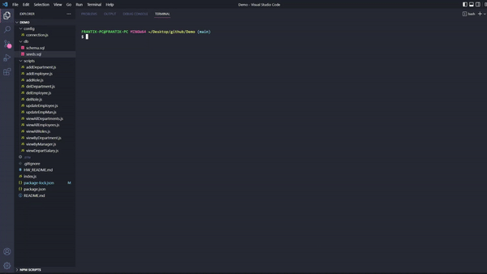

# 12-MySQL-Homework

## Table of Contents 📑
- [Description](#description)
- [Application Preview](#application-preview)
- [Installation](#installation)
- [Usage](#usage)
- [Links](#links)
- [Criteria](#criteria)
- [Technologies](#technologies)
- [Questions](#questions)
- [License](#license)
- [Notes](#notes)

## Description
Build a command-line application from scratch to manage a company's employee database, using Node.js, Inquirer, and MySQL.

## Application Preview

    

    

## Installation
- Copy the repository to your system
- Load schema.sql and seeds.sql
    - Option 1: Load by MySQL command line:
        - source schema.sql
        - source seeds.sql
    - Option 2: Load with MySQL Workbench
- Create .env file
    - SET DB_NAME to 'employees_db'
    - SET DB_USER to 'YOUR-MYSQL-USERNAME'
    - SET DB_PASSWORD to 'YOUR-MYSQL-PASSWORD'
- npm install
- node index.js

## Usage
- This application will allow users to view, add, and edit a company's employee database using MySQL queries

## Links
-   Github Repository:
    - https://github.com/brianalegre/12-MySQL-Homework
-   Video Demo (YouTube):
    - https://youtu.be/QMs57Ste1Bw
-   Vide Demo (Github):
    - https://github.com/brianalegre/12-MySQL-Homework/blob/main/assets/images/EmployeeTrackerDemo.mp4

## Criteria
- CLI Options
    - View All Departments, Roles and Employees
    - Add a Department, Role, and an Employee
    - Update an Employee's Role

- CLI Bonus Options
    - Update an Employee's Manager
    - View Employees by a Manager
    - View Employees by a Department
    - Delete a Department, Role, and an Employee
    - View Total Sum of Salaries in a Department

- Schema
    - Department
        - id: INT PRIMARY KEY
        - name: VARCHAR(30)
    - Role
        - id: INT PRIMARY KEY
        - title: VARCHAR(30)
        - salary: DECIMAL
        - department_id: INT
    - Employee
        - id: INT PRIMARY KEY
        - first_name: VARCHAR(30)
        - last_name: VARCHAR(30)
        - role_id: INT
        - manager_id: INT (NULL IF NO MANAGER)

## Technologies
- MySQL2
- Inquierer
- Console.table

## Questions
Questions? Concerns?  Contact Me Below:
- Github Username: brianalegre
- Github Link: https://github.com/brianalegre 
- Email: brialegre@yahoo.com

## License
- Copyright 2022 Brian Alegre
- Licensed under the: [MIT License](https://opensource.org/licenses/MIT) 

## Notes
- Example Video Demo
    - https://2u-20.wistia.com/medias/2lnle7xnpk
